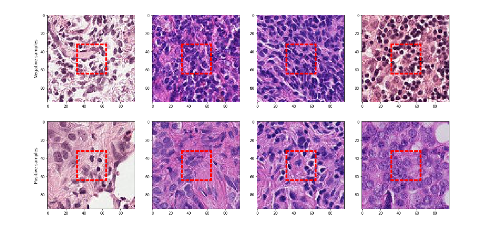
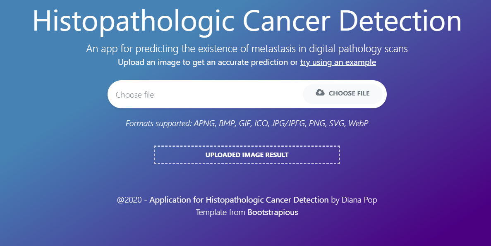
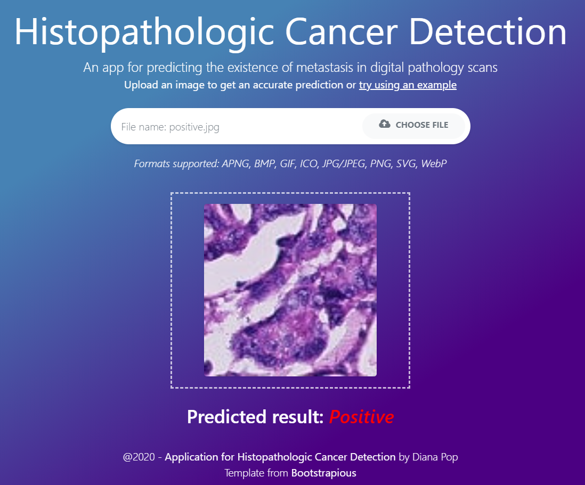
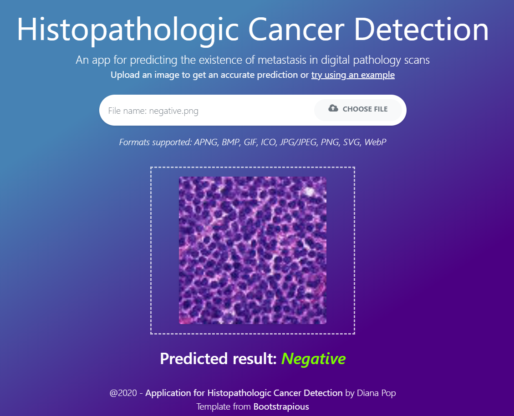

# Histopathological Cancer Detection

 
 

## Dataset found on [kaggle](https://www.kaggle.com/c/histopathologic-cancer-detection/data)

## Environment: 

- [PyCharm Community Edition](https://www.jetbrains.com/pycharm/download/#section=windows)
- [Anaconda Individual Edition](https://www.anaconda.com/products/individual) (including Jupyter Notebook)
- Optional: [VSCode](https://code.visualstudio.com/)

## Run flask app with: ```python -m flask run```





 